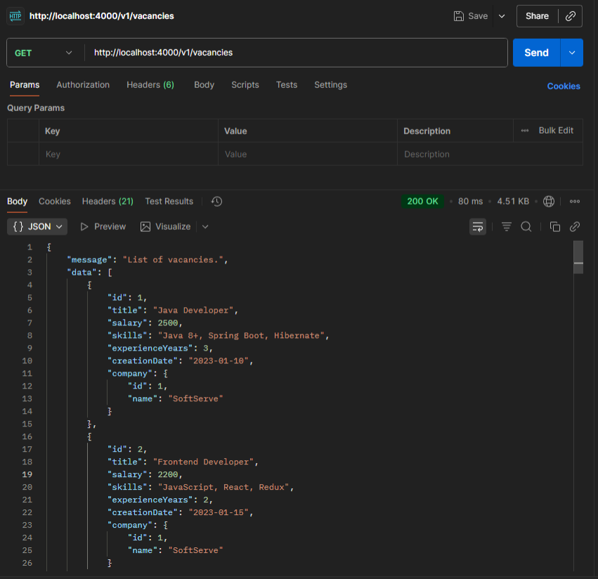
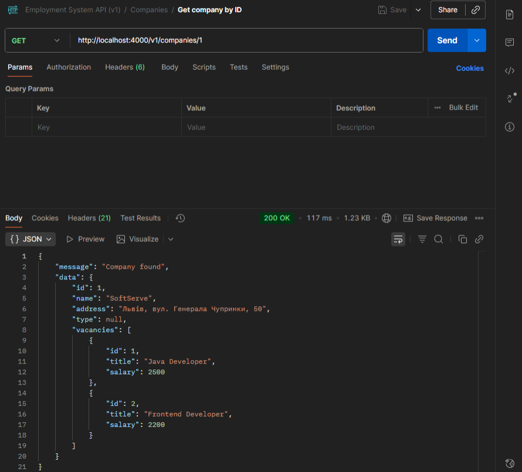
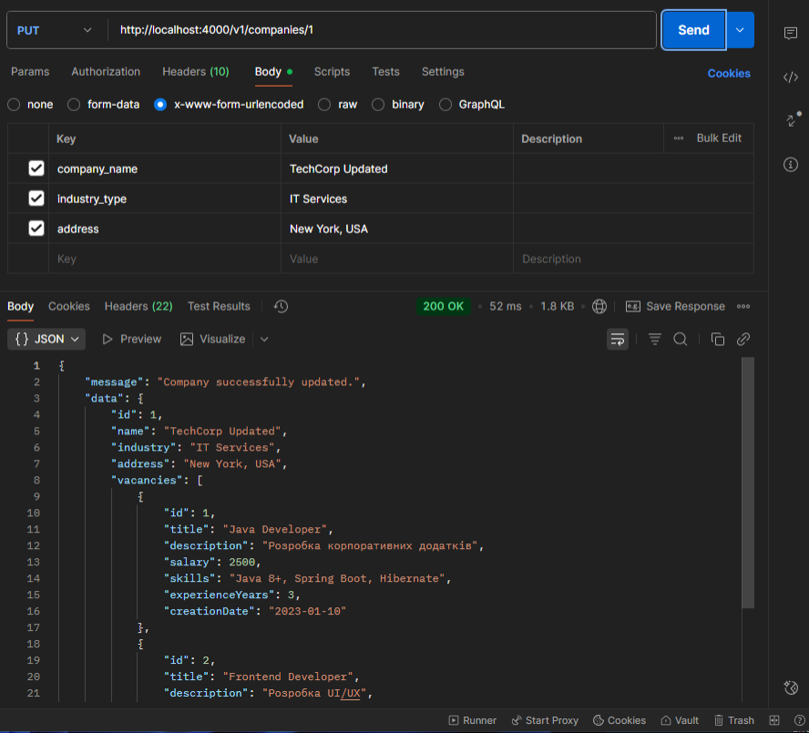
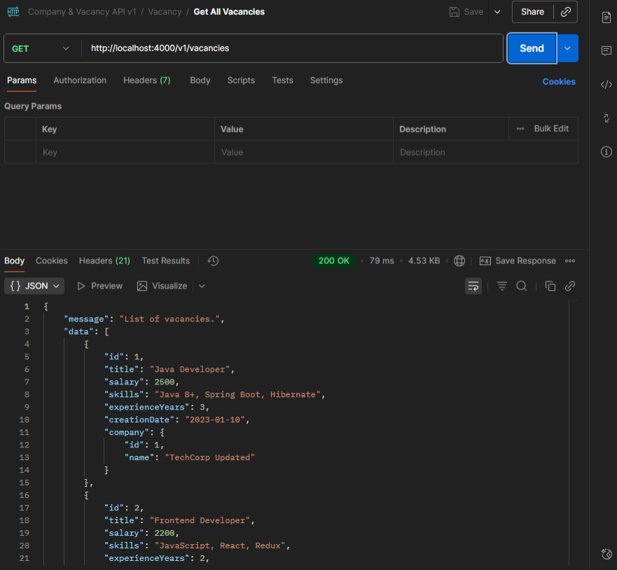
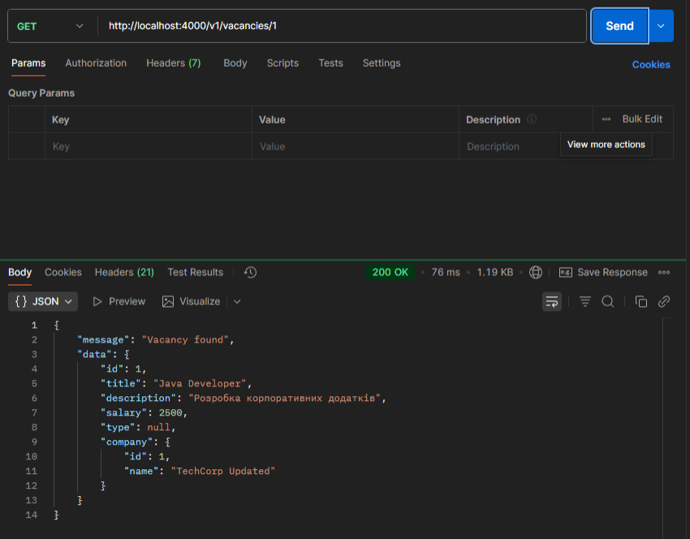

## Опис сутностей та їхніх зв’язків

### **Company**
**Призначення:**  
Зберігає інформацію про компанії, які розміщують вакансії в системі.

**Поля:**
- `id` — унікальний ідентифікатор компанії  
- `name` — назва компанії  
- `description` — короткий опис діяльності  
- `contactEmail` — контактний email  
- `createdAt` — дата створення запису  

**Зв’язки:**
- `Company` має зв’язок **один-до-багатьох** із сутністю `Vacancy`  
  *(одна компанія може мати декілька вакансій)*

---

### **Vacancy**
**Призначення:**  
Містить інформацію про вакансії, створені компаніями.

**Поля:**
- `id` — унікальний ідентифікатор вакансії  
- `title` — назва посади  
- `description` — опис вимог і обов’язків  
- `salary` — рівень оплати праці  
- `creationDate` — дата створення вакансії  
- `companyId` — зовнішній ключ, який пов’язує вакансію з компанією  

**Зв’язки:**
- `Vacancy` належить до однієї `Company` (*багато-до-одного*)

---

## **Маршрути API**

### `/vacancies`
| Метод | Шлях | Опис |
|-|-|-|
| **GET** | `/` | Отримати список усіх вакансій |
| **GET** | `/:id([0-9]+)` | Отримати вакансію за ID |
| **POST** | `/` | Створити нову вакансію |
| **PATCH** | `/:id([0-9]+)` | Оновити дані вакансії |
| **DELETE** | `/:id([0-9]+)` | Видалити вакансію |

---

### `/companies`
| Метод | Шлях | Опис |
|-|-|-|
| **GET** | `/` | Отримати список усіх компаній |
| **GET** | `/:id([0-9]+)` | Отримати компанію за ID |
| **POST** | `/` | Створити нову компанію |
| **PATCH** | `/:id([0-9]+)` | Оновити дані компанії |
| **DELETE** | `/:id([0-9]+)` | Видалити компанію |

## Ролі шарів
### Middleware (валідація)
 - Перевіряє вхідні дані (req.headers / req.body / req.query) до того, як запит потрапить у контролер.
 - Має повертати помилку (або кидати її) у стандартизованому форматі, якщо валідація не пройшла.
 - Не повинно виконувати бізнес-логіку чи доступ до БД.
 - Edge cases: часткова/opt поля при оновленні, числові/форматні перевірки, захист від ін’єкцій.
### Controller (оркестрація)
 - Оркеструє обробку: отримує req → викликає middleware (його вже виконав Express) → викликає Service → формує DTO → повертає відповідь клієнту або передає помилку в errorHandler.
 - Не містить складної логіки або запитів до репозиторію.
### Service (бізнес-логіка)
 - Інкапсулює правила предметної області: трансформації, валідації бізнес-правил, виклики до репозиторію, транзакції.
 - Повертає entity або throw/помилки у випадку бізнес-невідповідності.
### Repository / Data access
 - Абстрагує доступ до БД (наприклад TypeORM repository). Виконує CRUD, складні SQL/QueryBuilder, мапування entity.
 - Service має бути єдиним споживачем repository в контролері.

### Приклад коду middleware-функції
`router.post('/', [checkJwt, checkRole(['ADMINISTRATOR']), validatorCreateVacancy], create);`

### Приклад коду ResponseDTO та сервіс-класу
`const vacancyEntity = await vacancyService.findOne(id);
res.customSuccess(200, 'Vacancy found', new VacancyResponseDTO(vacancyEntity));`