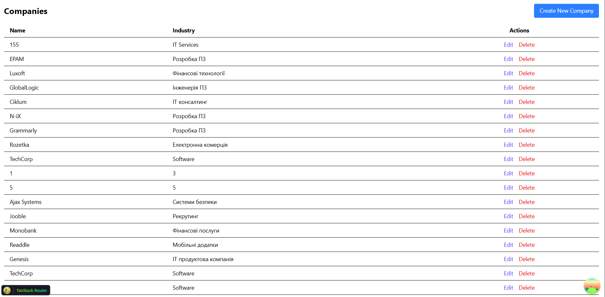
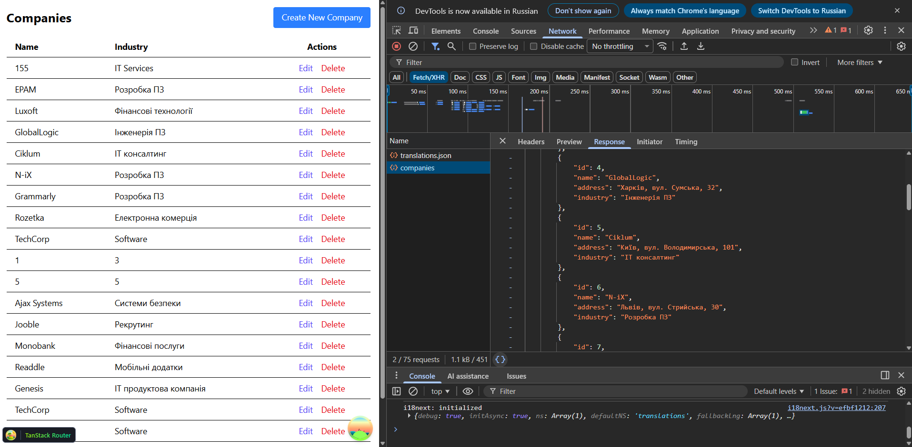
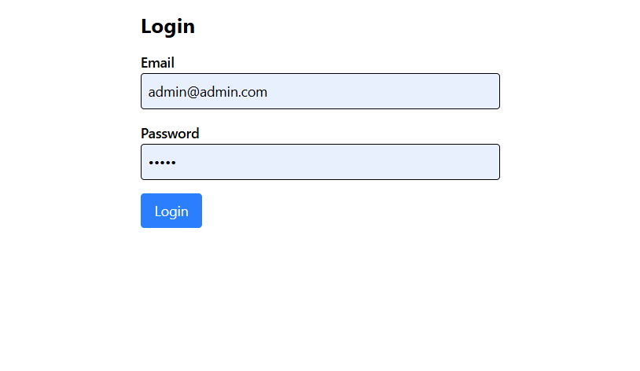
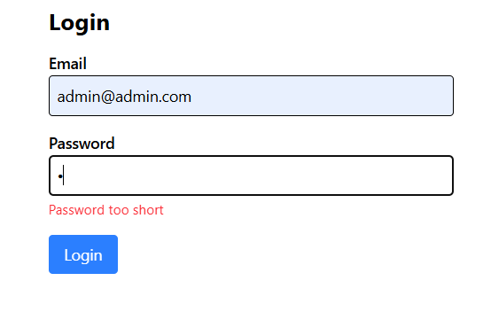

# Звіт 8 лабораторної роботи


**Короткий опис реалізованого функціоналу**

- **Ресурси**: реалізовано CRUD для `companies` і `vacancies`.
- **Маршрути**: файл-орієнтовані маршрути TanStack Router: `/companies`, `/companies/new`, `/companies/$companyId`, `/vacancies`, `/vacancies/new`, `/vacancies/$vacancyId`.

**Приклади ключевого коду**
- Хуки для TanStack Query
```ts
const getVacancies = async (): Promise<Vacancy[]> => {
  const res = await apiClient.get('/vacancies');
  const payload = res.data;
  if (Array.isArray(payload)) return payload as Vacancy[];
  if (payload && Array.isArray(payload.data)) return payload.data as Vacancy[];
  return [];
};
export const useVacancies = () => useQuery<Vacancy[]>({ queryKey: ['vacancies'], queryFn: getVacancies });

const getVacancyById = async (id: number): Promise<Vacancy> => {
  const res = await apiClient.get(`/vacancies/${id}`);
  const payload = res.data;
  if (payload && payload.data) {
    if (Array.isArray(payload.data)) return payload.data[0];
    return payload.data as Vacancy;
  }
  return payload as Vacancy;
};
export const useVacancy = (id: number) => useQuery<Vacancy>({ queryKey: ['vacancies', id], queryFn: () => getVacancyById(id) });


const createVacancy = async (payload: Omit<Vacancy, 'id'>): Promise<Vacancy> => {
  const params = new URLSearchParams();
  params.append('title', payload.title);
  if (payload.description) params.append('description', payload.description);
  if (payload.salary != null) params.append('salary', String(payload.salary));
  if (payload.company?.id) params.append('employer_id', String(payload.company.id));
  if ((payload as any).companyId) params.append('companyId', String((payload as any).companyId));
  const res = await apiClient.post('/vacancies', params.toString(), { headers: { 'Content-Type': 'application/x-www-form-urlencoded' }});
  return res.data;
};
export const useCreateVacancy = () => {
  const queryClient = useQueryClient();
  return useMutation({ mutationFn: createVacancy, onSuccess: () => queryClient.invalidateQueries({ queryKey: ['vacancies'] }) });
};
```

- схема Zod
```ts
const schema = z.object({
  email: z.string().email('Invalid email'),
  password: z.string().min(2, 'Password too short'),
});
```

**Скріншоти роботи програми**
- Сторінка компаній


- Вкладка Network у DevTools


- Сторінка входу


- Помилка валідації Zod


**Коментарі щодо особливостей реалізації та проблем, з якими зіткнулися**

- Порядок хуків

  Були випадки раннього `return` (наприклад, `if (isLoading) return <div>Loading...</div>`) до виклику деяких хуків у `VacancyEditPage.tsx`. Це спричинило помилку React про зміну порядку хуків. Помилка виправлена: усі хуки викликаються послідовно, повернення виконуються після них.

- Формат відправки (x-www-form-urlencoded)
  
  Для сумісності з бекендом (приклади в Postman) create/update формуються через `URLSearchParams` і відправляються з заголовком `application/x-www-form-urlencoded`. Якщо бекенд очікує JSON, потрібно змінити контракт. Зараз у коді є подвійна підтримка полів `employer_id` і `companyId` — це перестраховка.

- Нормалізація відповідей
  
  Бекенд повертає як "сирий" масив, так і обгортки `{ message, data }` або `{ rows: [...] }`. У хуках є нормалізація (`payload.data`, `payload.rows`, `payload.payload`), щоб UI надійно працював незалежно від форми відповіді.

- Роутинг
  
  Проєкт використовує згенерований `routeTree.gen.ts` від TanStack Router. При додаванні/перейменуванні файлів маршрутів потрібно регенерувати дерево маршрутів.


