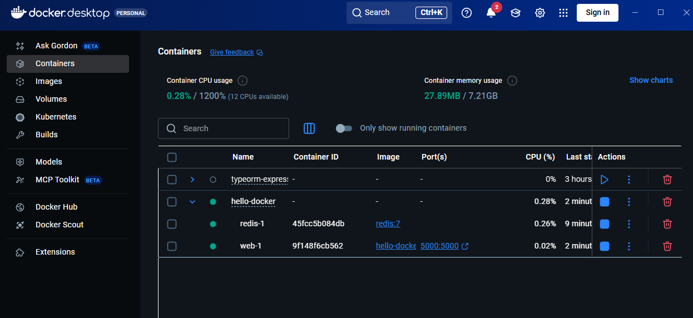
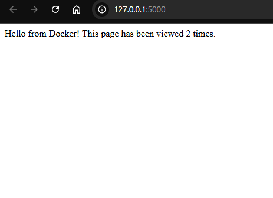

# Робота з Dockerfile та Docker Compose

- Працюючий Flask + Redis у Compose

- Коректний Dockerfile з усіма директивами

- Скріншот лічильника в браузері

### Висновки
У ході роботи я навчився працювати з директивами Dockerfile і запускати багатосервісний застосунок (Flask + Redis) за допомогою Docker Compose.