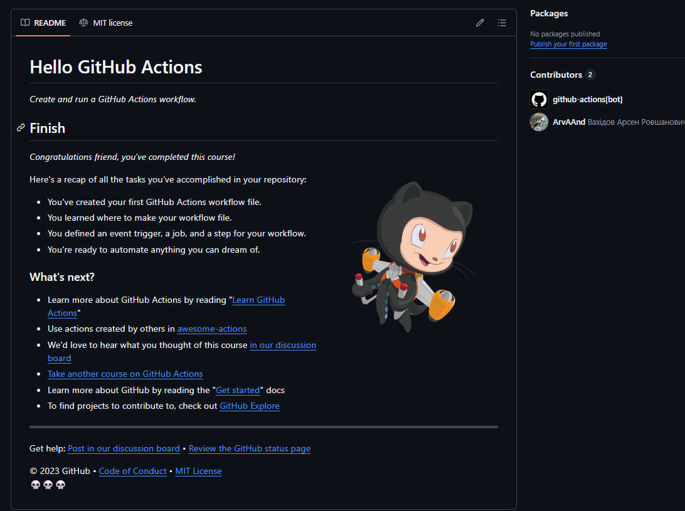
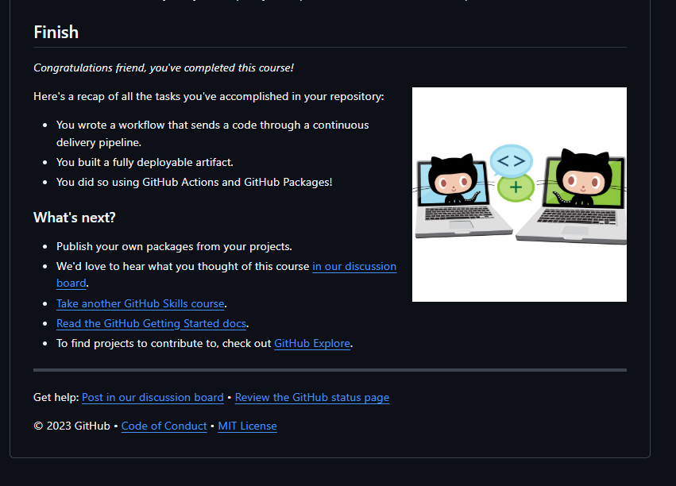
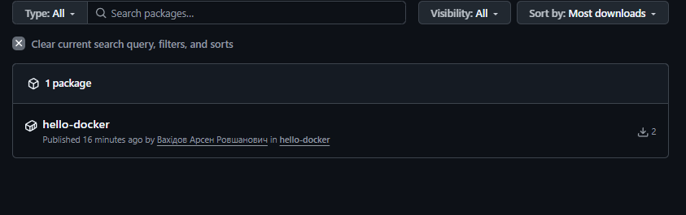

## Практично-лабораторна робота з теми "Неперервна інтеграція"

#### Виконанні завдання
1. Завершені практичні роботи на GitHub Skills, надаю посилання на
репозиторії з виконаним завданням:
- [Hello GitHub Actions](https://github.com/ArvAAnd/skills-hello-github-actions)
- [Publish Packages](https://github.com/ArvAAnd/skills-publish-packages)
2. Власний GitHub Workflow для збірки докер-образу  та завантаження його у GitHub container registry:
- [hello-docker](https://github.com/ArvAAnd/hello-docker)

#### Скриншоти

- Виконане Hello GitHub Actions

- Виконане Publish Packages

- Packages власного GitHub Workflow

#### Висновки

У ході цієї практично-лабораторної роботи було засвоєно та використано навички автоматизації неперервної інтеграції в GitHub Actions